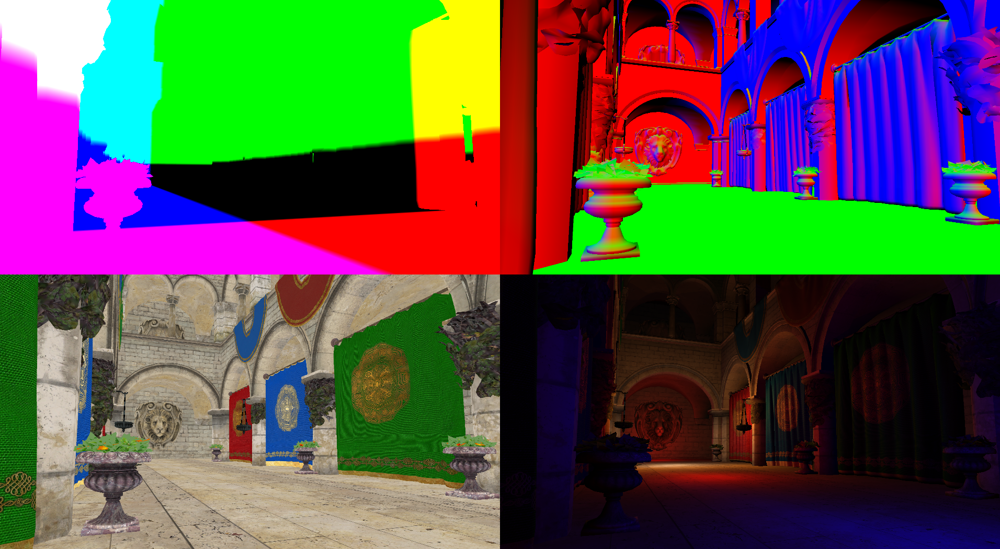

# Vulkan Sponza

## About

Vulkan deferred rendering playground using [Crytek's Atrium Sponza Palace model](http://www.crytek.com/cryengine/cryengine3/downloads).

Partially based on my Vulkan examples, with the goal of rendering a more complex scene outside of the example's scope.

As this is just a playground, expect frequent (and possibly breaking) changes.
