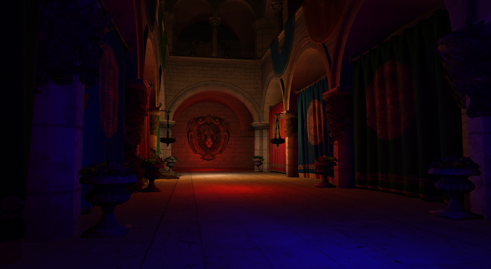

# Vulkan Sponza

 

## About

A Vulkan deferred rendering playground

Partially based on my Vulkan examples (C++), with the goal of rendering a more complex scene outside of the example's scope.

As this is just a playground, expect frequent (and possibly breaking) changes.

## Platforms
Windows, Android and Linux

Visual Studio 2015 project is included along with a CMakeLists.txt for other compilers and platforms.

## Features
- Deferred renderer (4 MRTs)
- Separate pass for alpha masked objects (foliage)
- Multiple dynamic light sources
- Normal mapping
- SSAO

## The Sponza scene
The model used for this example is [Crytek's Atrium Sponza Palace model](http://www.crytek.com/cryengine/cryengine3/downloads). The repository contains an updated version of the (already updated) version from [Morgan McGuire](http://graphics.cs.williams.edu/data/meshes.xml).

For this demo I imported it into [Blender](https://www.blender.org/) (so you can use it with your favorite open source 3D application), added some missing normal maps and assigned all the maps in blender so you can easily load up the scene using [ASSIMP](https://github.com/assimp/assimp) and extract all information required for rendering like names of the diffuse, normal and specular maps and information on wether the material has a mask for e.g. rendering in a separate pass for transparent objects. The demo will load this scene using the COLLADA file exported from blender.
